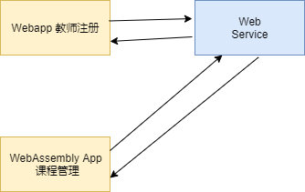

# Rust 开发 Web 项目演示代码

参考视频地址: [Rust Web 全栈开发教程](https://www.bilibili.com/video/BV1RP4y1G7KF?p=17)

## 项目结构



## webservice

1.修改 <b>.env.example</b> 为 <b>.env</b> 并设置为你的 PostgreSQL 数据库连接

2.初始化数据库, 初始化 SQL 文件, [点击这里](./webservice/docs/)

3.根目录运行:

```bash
$ make run
```

## wasm-client

注意：这里用 Webassembly 开发绕了一个大圈, 主要是为了学习 Webassembly 在 Web 中的使用, 并不是所有的 Rust crate 都能在 Webassembly 里使用, 只有一小部分能使用

1.编译

```
$ cd wasm-client
$ wasm-pack build
```

2.让前端加载编译好的 wasm

```
$ cd www
$ npm install
```

3.运行 www 前端

```
$ npm run start
```
